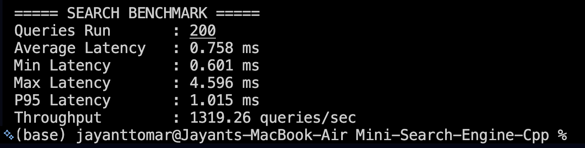

# Fast Mini Search Engine in C++

### Multithreaded Inverted Index • BM25 Ranking • Trie Autocomplete • REST APIs • Web UI

This project implements a **dynamic full-stack search engine written in C++** that demonstrates several core ideas used in real-world search systems.

It supports **fast document retrieval using an inverted index**, **BM25 ranking**, **phrase & proximity boosting**, **Trie-based autocomplete**, and **runtime document ingestion** with an interactive web interface.

The system is designed with **clean architecture, performance-aware indexing, and modular components**, making it a great demonstration of **information retrieval, data structures, concurrency, and backend system design**.

---

# Demo

## Working Video
https://www.youtube.com/watch?v=cc0ks_HMolY

---

# Project Highlights

## Fast Ranked Search
- Uses **inverted index** for near O(1) term lookup
- Implements **BM25 ranking algorithm**
- Supports **multi-word queries**

## Intelligent Ranking Signals
Search relevance is improved using:
- **BM25 scoring**
- **Phrase boosting**
- **Proximity boosting (k-word window)**

## Spell Correction
- Implemented using **Levenshtein edit distance**
- Uses **document frequency tie-breaking** to choose best correction

Example:


recieve → receive
serach → search


## Trie-Based Autocomplete
- Prefix suggestions using **Trie**
- Supports extended tokens such as:


C++
file.txt
snake_case
namespace::function


## Multithreaded Indexing
Initial corpus indexing uses **parallel processing**:


Thread 1 → Documents 0–N
Thread 2 → Documents N–2N
Thread 3 → Documents 2N–3N


Each thread builds a **local inverted index**, followed by a **merge phase**.

This avoids:
- mutex locks
- race conditions
- lock contention

## Hybrid Indexing Pipeline

The system uses **two indexing strategies**:

| Workload | Strategy |
|--------|--------|
| Initial corpus | Multithreaded indexing |
| Runtime uploads | Incremental single-document indexing |

This ensures:
- fast bulk indexing
- instant availability of uploaded documents

## Runtime Corpus Management

Uploaded documents are stored in a **temporary runtime corpus**:


runtime_corpus/


Behavior:
- documents become searchable immediately
- folder automatically resets when the server restarts
- prevents stale runtime data accumulation

## Performance Benchmarking

The system includes a **benchmark endpoint** comparing:

- Single-thread indexing
- Multi-thread indexing
- Speedup ratio

Displayed directly in the UI.

## System Observability

The web interface displays:

- Search latency
- Indexing latency
- Corpus size
- Vocabulary size
- Threads used during indexing

---

## System Architecture

```
User (Browser)
↓
Frontend (HTML / CSS / JS)
↓ HTTP Requests
C++ HTTP Server (cpp-httplib)
↓
SearchEngine Core
↓
Inverted Index + Trie
```


## Performance Benchmarks

### Corpus Statistics

- Documents Indexed: 1004
- Vocabulary Size: 33,360 unique terms

### Indexing Performance

| Mode | Time |
|---|---|
| Single-threaded | 838.958 ms |
| Multi-threaded | 392.348 ms |
| Threads Used | 8 |
| Speedup | 2.14× |

### Search Performance

| Metric | Result |
|---|---|
| Average Latency | 0.833 ms |
| P95 Latency | 1.082 ms |
| Min Latency | 0.592 ms |
| Max Latency | 5.038 ms |
| Throughput | 1199.68 queries/sec |

### Benchmark Screenshots





### Components

| Layer | Responsibility |
|------|---------------|
| Frontend | User interface & query visualization |
| HTTP Server | REST API layer |
| SearchEngine | Indexing, ranking, query processing |
| Trie | Autocomplete suggestions |
| Inverted Index | Word → document mapping |

---

## Project Structure

```
Mini_Search_Engine_C++/
│
├── backend/
│ ├── include/
│ │ ├── SearchEngine.h
│ │ ├── Trie.h
│ │ └── httplib.h
│ │
│ ├── src/
│ │ ├── SearchEngine.cpp
│ │ └── Trie.cpp
│ │
│ └── server.cpp
│
├── frontend/
│ ├── index.html
│ ├── script.js
│ └── style.css
│
├── documents/
│ ├── doc1.txt
│ ├── doc2.txt
│ └── doc3.txt
│
└── runtime_corpus/
```

---

# How the System Works

## Indexing Phase

Documents are processed once during indexing.

For each word:
- normalize text
- update inverted index
- store frequency
- store word positions
- store byte offsets
- insert word into Trie

Example index entry:


search → {
doc1 : {freq=3, positions=[2,15,30]}
doc2 : {freq=1, positions=[7]}
}


---

## Query Processing Phase

When a user submits a query:


machine learning


Steps:

1. Tokenize and normalize query  
2. Spell-correct unknown terms  
3. Retrieve candidate documents  
4. Compute **BM25 ranking score**  
5. Apply phrase boost  
6. Apply proximity boost  
7. Extract contextual snippet  
8. Sort and return results  

---

# Ranking Formula

The engine uses **BM25 scoring**:


Score = Σ BM25(term, doc)
+ PhraseBoost
+ ProximityBoost


BM25 parameters:


k1 = 1.5
b = 0.75


Phrase boost:


1.5 × phrase_frequency


Proximity boost:


0.75 × proximity_matches


---

# REST API Endpoints

| Endpoint | Description |
|--------|-------------|
| `/search?q=` | Search query |
| `/autocomplete?prefix=` | Prefix suggestions |
| `/upload` | Upload new document |
| `/loadSample` | Load initial corpus |
| `/rebuildIndex` | Rebuild index |
| `/corpusInfo` | Corpus statistics |
| `/benchmark` | Indexing benchmark |
| `/clearCorpus` | Clear runtime corpus |

---

# Example Queries

### Exact Search


search engine
machine learning
inverted index


### Autocomplete


se → search, search-engine
ma → machine, machine-learning


### Spell Correction


recieve → receive
serach → search


---

# Time Complexity

| Operation | Complexity |
|-----------|-----------|
| Indexing | O(total words) |
| Search | O(candidate_docs log candidate_docs) |
| Autocomplete | O(prefix_length + results) |
| Spell Correction | O(vocabulary × word_length²) |

---

# Concepts Used

- Inverted Index
- BM25 Ranking
- Phrase & Proximity Search
- Trie Data Structure
- Edit Distance (Levenshtein)
- Multithreaded Processing
- REST API Design
- File System Management
- Frontend–Backend Integration

---

# Future Improvements

Possible upgrades:

- Phrase chain matching for multi-word queries
- Distance-weighted proximity scoring
- Persistent disk-based index
- Query result caching
- Distributed search architecture
- Ranked autocomplete suggestions

---

# Author

**Jayant Tomar**

Computer Science Engineering — Delhi Technological University

Focus Areas:
- Information Retrieval
- Backend Systems
- Search Infrastructure
- Performance Optimization
